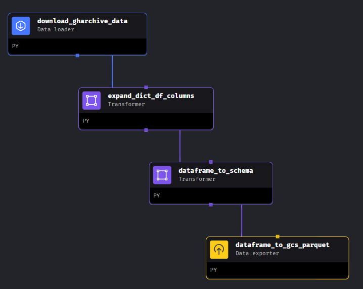
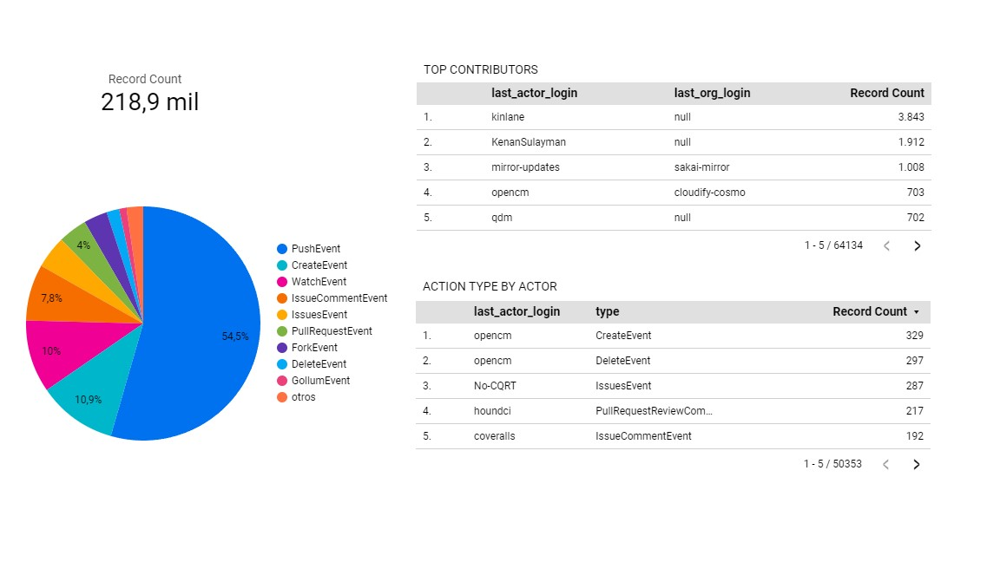

# data-engineer-gharchive

## Index

- [Problem Statement](#problem-statement)
- [Google credentials](#google-credentials)
- [ETL](#etl)
    - [Manual ETL](#manual-etl)
    - [Mage orchestrator](#mage-orchestrator)
- [Terraform](#terraform)
- [Spark](#spark)
- [Dashboard and results](#dashboard-and-results)
- [What to do next](#what-to-do-next)

## Problem Statement

For monitoring purposes, it is important to know the top contributors to GitHub in a specified date and analyze the type of actions the users perform the most, apart from commits. 

For this, I used the data from [GH Archive](https://www.gharchive.org/), which stores information of all the events performed in GitHub, aggregated into hourly archives.

From the technical point of view, a cleaner version of raw data in a data lake and processed data in a data warehouse are needed so that they can be used to make the dashboard.

The pipeline should be able to handle batch data processing for historical analysis (days, months,...) and real-time processing with hourly triggers.

All Google Cloud infrastructure has been handled using Terraform (IaC).

### Technologies:

- **Python**: Scripting
- **Git/GitHub**: Code versioning
- **Pyspark, Apache Spark 3**: Distributed data transformations
- **Google Cloud**: Cloud provider
    - **Cloud Run**: Mage hosting
    - **Google Cloud Storage**: Data Lake
    - **Google BigQuery**: Data Warehouse
- **Terraform**: Infrastructure as Code (IaC)
- **Mage**: Orchestration
- **Looker Studio**: Dashboard creation

### Workflow summary:
1. Download google credentials
1. Terraform deployment
1. ETL phase orchestrated with Mage:
    1. Download the data from the provided link 
    1. Clean the data structure and homogenize the data following a predefined schema
    1. Save the data into a parquet file at a GCS bucket
1. Structure the data with pyspark into a BigQuery table
1. Analyze the BigQuery data in Looker Studio

## Google credentials

For all the cloud-based steps, google requires credentials. Follow these steps to prepare them for the project:

1. Download credentials.json following the instructions here: https://cloud.google.com/iam/docs/keys-create-delete
1. Rename the json into `secrets.json`
1. Save it into the terraform folder

## Terraform

### Deployment Resources:

- **Mage Terraform Module**: deploy the ETL pipeline via Cloud Run. Access the module [here](https://github.com/mage-ai/mage-ai-terraform-templates/tree/master/gcp-dev).
- **Google Storage**: Data lake for storing cleaner raw data.
- **BigQuery Table**: Data warehouse for storing processed data.

### Running the Deployment:
1. Modify the project ID and variables in the variables.tf file.
1. Ensure the credentials are available in the path specified by the credentials variable.
1. After executing terraform apply:
    1. Allow manual invocation by unauthenticated users: Navigate to Security => Authentication => Allow unauthenticated invocations.
    1. Networking => Ingress Control => All
1. Utilize the URL in the web browser to access the Mage server
1. In the settings tab, include the Git configuration within Mage to upload the code for execution
1. Check the trigger and phases has been correctly uploaded
1. Execute Mage to download batch data as specified in its phase, or keep the compute instance active to enable automatic execution of the ETL process based on the set trigger

### Additional Notes:
- For users with a free GCP account, delete load_balancer.tf and remove the output service_ip from main.tf in the Mage module.
- If the credentials specified in variables.tf fail, export the credentials by running the command: `export GOOGLE_APPLICATION_CREDENTIALS="secrets.json"` in the terminal.
- If the SQL database is created and deleted, wait before reusing the same name to avoid Error 409. Modify the name in the db.tf Google SQL database instance.
- The volume secrets and IAM user have been commented due to role permissions in GCP.
- During apply and destroy, multiple runs may be necessary with intervals between each run to allow time for deploying/deleting dependent resources.

## ETL

### ETL Workflow:

1. The latest hour's data from gharchive is downloaded in .json.gzip format using [download_data.py](etl/download_data.py)
1. Compressed data is converted into a list of dictionaries with [transform_data.py](etl/transform_data.py)
1. The list of dictionaries is transformed into a dataframe using [transform_data.py](etl/transform_data.py)
1. Columns with fixed json keys (actor, repo, org) are expanded into more columns with [transform_data.py](etl/transform_data.py)
1. The input data is checked and converted into the predefined schema: [convert_data_to_schema.py](etl/convert_data_to_schema.py):
    1. Extra columns are deleted
    1. Missing columns are added
    1. Columns are checked and changed to dtype
1. Save the processed data locally in parquet format using ([manual ETL](etl/__main__.py)) or upload it to a GCS bucket using ([mage ETL](https://github.com/AlmudenaZhou/mage-gharchive-etl-orchestration))

Note:
org_id is an integer that can be Null and requires an integer nullable type (pd.Int64Dtype()).

Explore the complete workflow in the [ETL notebook](etl/data_pipeline.ipynb)

### Manual ETL

You can execute the ETL process without using an orchestrator by running the following command in the terminal from the data-engineer-gharchive folder:

`python etl --year=2015 --month=1 --day=1 --hour=15`

Make sure to specify the year, month, day, and hour for your data.

### Mage orchestrator

For bulk data processing, I used the backfilled mage feature. The calls are made individually and depend on the environment variable execution_date to backfill dates that were missing.

To download data hourly, I configured an hourly trigger to automatically run the pipeline.
 
The repository has been configured as a submodule to facilitate synchronization with Google Cloud Run: [Mage Repository](https://github.com/AlmudenaZhou/mage-gharchive-etl-orchestration)

## Spark

I read the parquet files generated at the [ETL phase](#etl) (at the Google Storage Bucket), transformed them using pyspark and loaded them into a BigQuery table. The table is partitioned by action_time to accommodate the data retrieved over time intervals. Additionally, it's clustered by last_actor_login to facilitate user-based analysis.

Data transformations:
- Deleted unneccessary columns
- Added a new column called `created_at`, which includes the timestamp of the insertion. Additionally, I renamed the existing column, previously named `created_at`, to `action_time`.
- Introduced new columns with the last name for each ID associated with actors, repositories, and organizations

All the process, included the data analysis and the reasons why I chose those transformations, is documented [here](spark/README.md).

## Dasboard and results

In this phase, I used Looker Studio connected to the BigQuery table to create the dashboard.

On that particular day, there were 218.9 thousand recorded events

The top category, PushEvent (commits), significantly surpassed the second category, CreateEvent (create a new repository).

The top 5 contributors were kinlane, KenanSulayman, mirror-updates, opencm and qdm.

In the table labeled `ACTION TYPE BY ACTOR`, where PushEvent type contributions are excluded from the view, interesting observations were made. Particularly, it was noted that the user "opncm" created and deleted multiple repositories on that specific day.

## What to do next

- Develop a mechanism to verify whether the data for a specific time period has been processed, both in its raw form and after processing. Since the data remains constant over time, this step will help avoid unnecessary resource consumption.
- Review the latency in the data uploadig from the past hour to ensure minimal loss of information and minimal wait time to confirm data completion.
- Implement Mage CI/CD: 
  - GitHub actions: https://docs.mage.ai/production/ci-cd/local-cloud/github-actions
  - GitHub Sync
- Automated Spark job execution using Dataproc and Google Scheduler in Google Cloud, scheduled to run hourly.
